```{r xaringan-themer, include=FALSE, warning=FALSE}
library(xaringanthemer)
pal <- c(
  babyblue = "#caf0f8",
  white = "#FFFFFF"
)


style_mono_accent(base_color = "#004346",
                  white_color = "#FFFFFF",
                  black_color = "#172A3A",
                  link_color = "#508991",
                  text_bold_color = "#09BC8A",
                  text_slide_number_color = "#172A3A",
                  code_highlight_color = "#FFC857",
                  code_inline_color = "#D66853",
                  link_decoration = "underline",
                  header_font_google = google_font("Roboto Slab"),
                  text_font_google   = google_font("Lato", "400"),
                  code_font_google   = google_font("Fira Mono"),
                  colors = pal
                  )
```

```{r setup, include=FALSE}
knitr::opts_chunk$set(echo = TRUE, 
                      message = FALSE, 
                      warning = FALSE,
                      fig.width = 7,
                      fig.asp = 0.75,
                      fig.retina = 3)
library(knitr)
```

background-image: url("img/cb_qual2.png")
background-position: left
background-size: 50%
class: middle, center, inverse


.pull-right[


# .white[Communicating with Data Visualizations]

<br>

<br>

### .white[Kelly McConville]

#### .babyblue[Stat 98 | Week 10 | Spring 2022] 

]

---

# Goals for Today

* Considerations when communicating with graphs

* This won't be a `ggplot2` tutorial! 


---

class: inverse, middle, center


## What do you consider when creating a graph?


---


### Considerations: [Proportional Ink](https://www.businessinsider.com/the-top-10-most-read-books-in-the-world-infographic-2012-12)

.pull-left[

**Principle of proportional ink:** The size of shaded areas need to be proportional to the data values they represent.

]

.pull-right[

```{r  out.width = "95%", echo=FALSE, fig.align='center'}
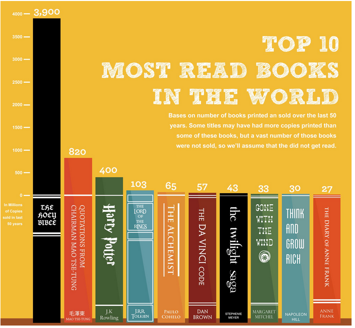 
```

] 

--

* Bars on a linear scale should start at 0.


---

### Considerations: [Proportional Ink](https://www.nytimes.com/2020/10/08/learning/whats-going-on-in-this-graph-consumer-spending-during-the-pandemic.html)


.pull-left[


**Principle of proportional ink:** The size of shaded areas need to be proportional to the data values they represent.

]

.pull-right[


```{r  out.width = "95%", echo=FALSE, fig.align='center'}
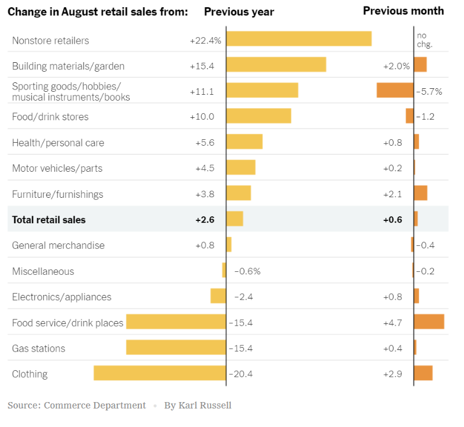 
```


]

* Bars on a linear scale should start at 0.

---

### Considerations: [Supporting Text](https://fivethirtyeight.com/features/what-ruth-bader-ginsburgs-death-could-mean-for-2020-and-the-supreme-court/)

.pull-left[ 

Consider including:

* Title (or Figure Caption)
* Subtitle
* Axis labels (with units)


] 

.pull-right[ 

* Legends/helpers (with units)
* Maker
* Data Source
* Key points

]

```{r  out.width = "70%", echo=FALSE, fig.align='center'}
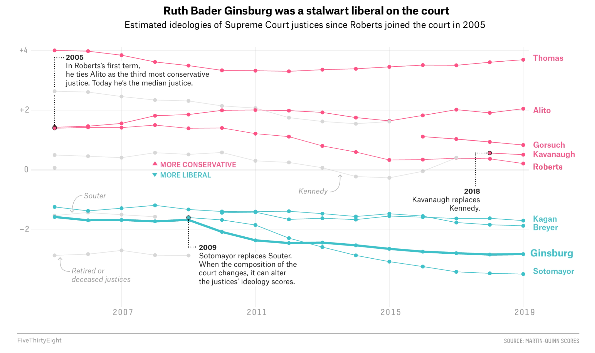 
```

---

### Considerations: [Context, Context, Context!](https://www.nytimes.com/2020/01/23/learning/whats-going-on-in-this-graph-jan-29-2020.html)

```{r  out.width = "90%", echo=FALSE, fig.align='center'}
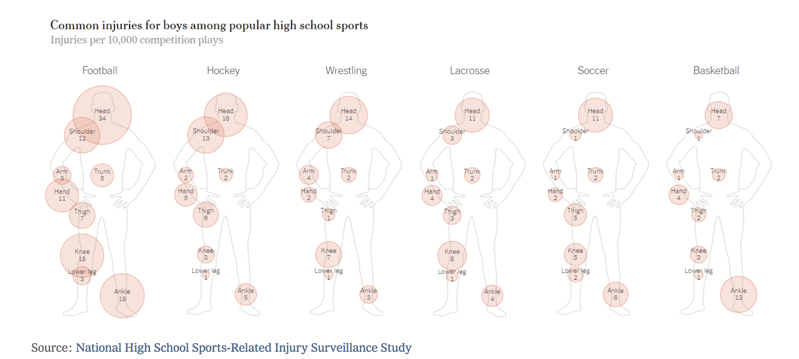 
```

---

### Considerations: [Simplifying by Faceting](https://fivethirtyeight.com/features/ted-cruzs-general-election-strategy-is-wishful-thinking/) 

* Great way to add another variable without over-complicating your graphic.

```{r  out.width = "50%", echo=FALSE, fig.align='center'}
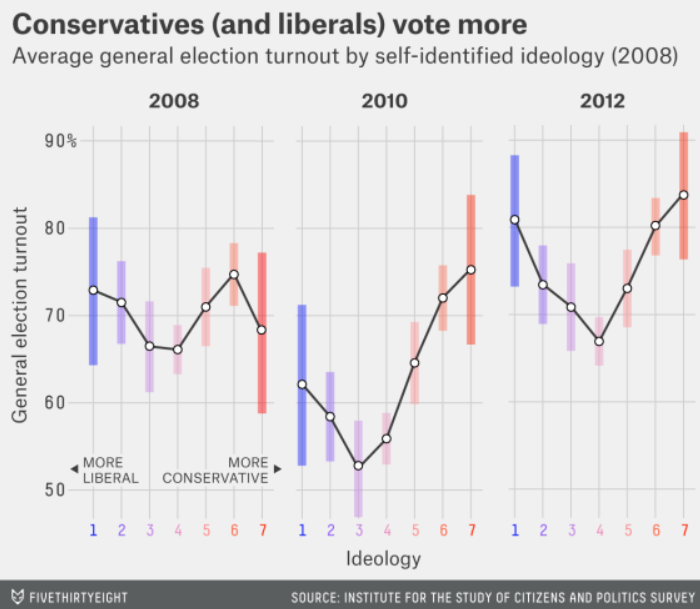 
```

---

### Considerations: [Color Palettes](https://colorbrewer2.org)

.left-column[

**Sequential**: Ordered data with one direction

]

.right-column[

```{r  out.width = "90%", echo=FALSE, fig.align='center'}
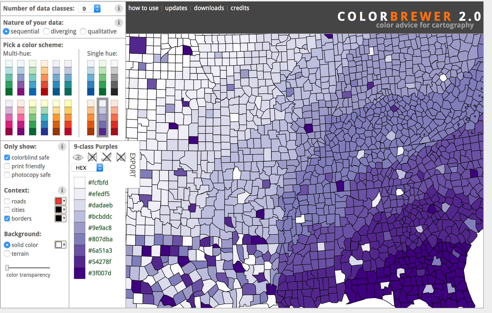 
```

]

---

### Considerations: [Color Palettes](https://colorbrewer2.org)

.left-column[

**Diverging**: Ordered data with two directions

]

.right-column[

```{r  out.width = "80%", echo=FALSE, fig.align='center'}
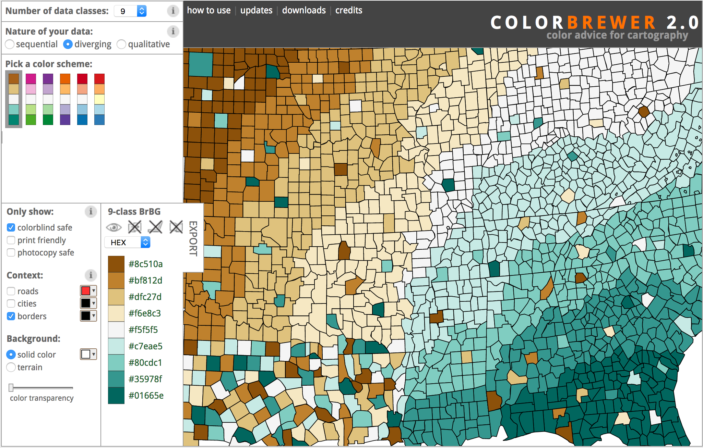 
```

]

---

### Considerations: [Color Palettes](https://colorbrewer2.org)

.left-column[

**Qualitative**: No order to the data

]

.right-column[

```{r  out.width = "80%", echo=FALSE, fig.align='center'}
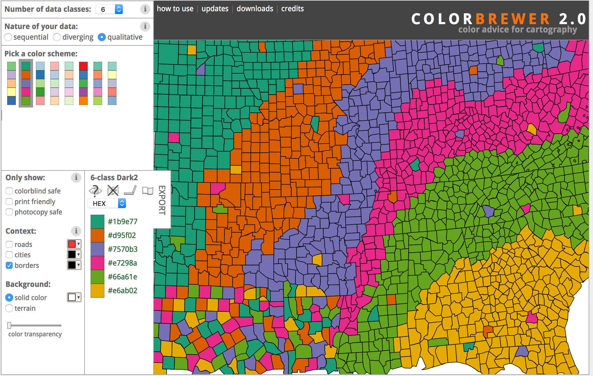 
```

]

---

### Considerations: Color Palettes

.left-column[

Which type(s)?

]


.right-column[

```{r  out.width = "80%", echo=FALSE, fig.align='center'}
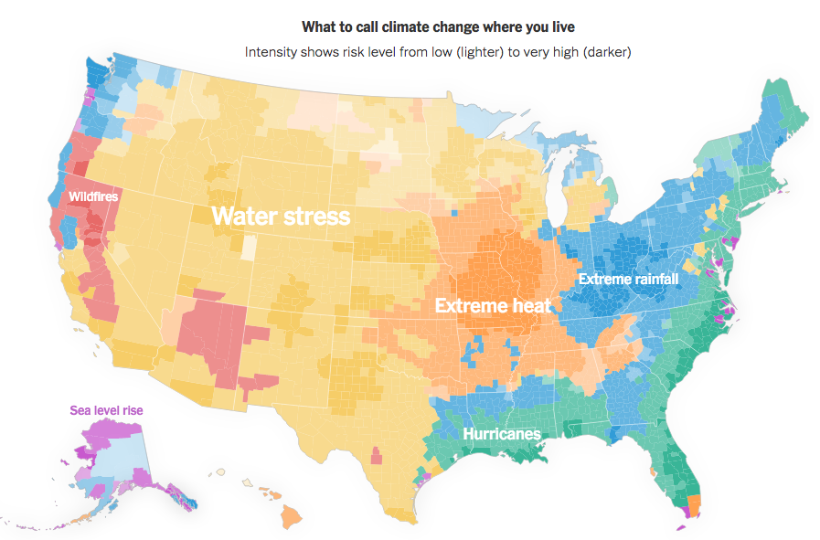 
```

]

---

### Common R Color Palettes


.left-column[

* Easy to see differences?
* Perceptually uniform?
* Robust to colorblindness?
* Pretty?

]

.right-column[


```{r  out.width = "70%", echo=FALSE, fig.align='center'}
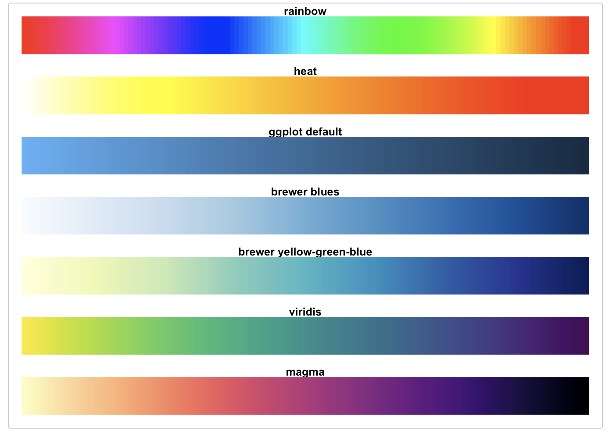 
```

]


---

### Color Blindness: Red-Blind

```{r  out.width = "60%", echo=FALSE, fig.align='center'}
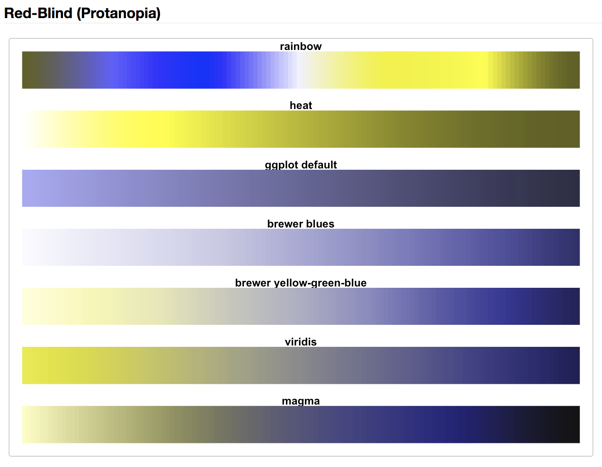 
```

---

### Color Blindness: Green-Blind

```{r  out.width = "60%", echo=FALSE, fig.align='center'}
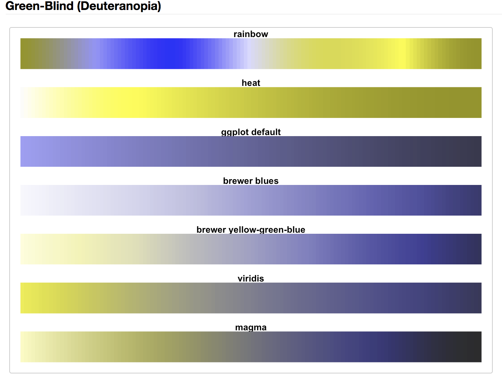 
```


---


### Considerations: [Aspect Ratio](http://socviz.co/lookatdata.html)

* Aspect ratio affects our perception of the rate of change

```{r  out.width = "80%", echo=FALSE, fig.align='center'}
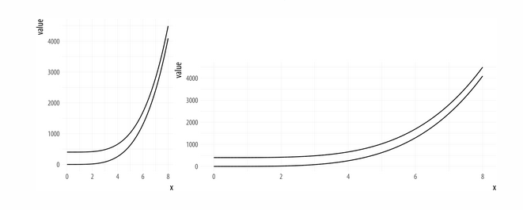 
```


---

### Considerations: [Make Important Comparisons Easy](https://serialmentor.com/dataviz/visualizing-proportions.html)

* Which graph makes it easy to conclude that the ruling coalition (FDP + SPD) have a majority?

```{r  out.width = "70%", echo=FALSE, fig.align='center', fig.cap = "Wilke (2019)"}
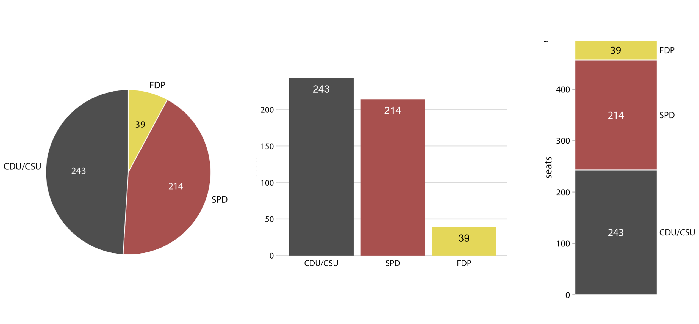 
```


---
    
### Considerations: [Make Important Comparisons Easy](https://serialmentor.com/dataviz/visualizing-proportions.html)


* Which graph makes it easy to see how a company's market share changes over time? (Warning: Fake data.)

```{r  out.width = "80%", echo=FALSE, fig.align='center', fig.cap = "Wilke (2019)"}
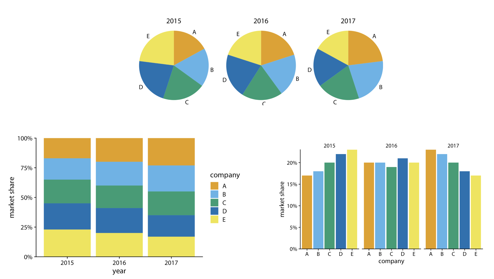 
``` 

---


### Considerations: Font Size

.pull-left[

Don't just assume the defaults are best!

```{r plot, fig.show = 'hide'}
library(palmerpenguins)
library(ggplot2)
ggplot(data = penguins, 
       mapping = aes(x = flipper_length_mm,
                     y = bill_length_mm,
                     color = island)) +
  geom_point()
```

]

.pull-right[

```{r, echo = FALSE}
knitr::include_graphics(knitr::fig_chunk("plot", "png"))
```

]


---


### Considerations: Font Size

.pull-left[

Don't just assume the defaults are best!

```{r plot2, fig.show = 'hide'}
library(palmerpenguins)
library(ggplot2)
theme_update(text = element_text(size = 20))
ggplot(data = penguins, 
       mapping = aes(x = flipper_length_mm,
                     y = bill_length_mm,
                     color = island)) +
  geom_point()
```

]

.pull-right[

```{r, echo = FALSE}
knitr::include_graphics(knitr::fig_chunk("plot2", "png"))
```

]

---

## So Many Choices

#### Example: ["One Dataset, Visualized 25 Ways"](https://flowingdata.com/2017/01/24/one-dataset-visualized-25-ways/#jp-carousel-47350)


* Which of these graphs are **more** effective?
* Which of these graphs are **less** effective?


---

class: inverse, middle, center

## Final Thought

--

### Figure out your story.

--

### Make it **easy** for your viewers to identify the story.


---

## Some of My Favorite Data Viz Resources


* [Fundamentals of Data Visualization](https://clauswilke.com/dataviz/) by Claus Wilke
* [Data Visualization: A practical introduction](https://socviz.co/index.html#preface) by Kieran Healy

<!-- mix of math 241 slides from day 2 and intro to mod stat + deb nolan's book -->


<!-- https://reed-statistics.github.io/math241s21/slidesWk1Th.html#42 -->