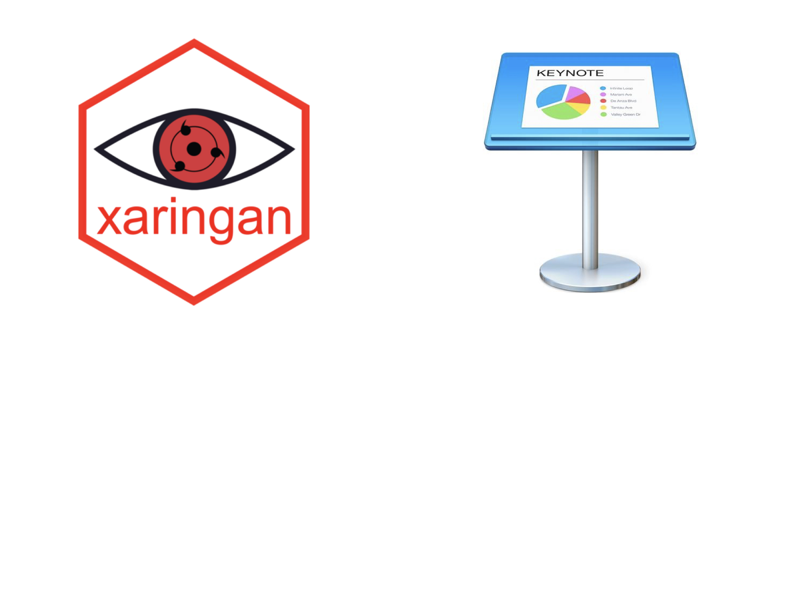
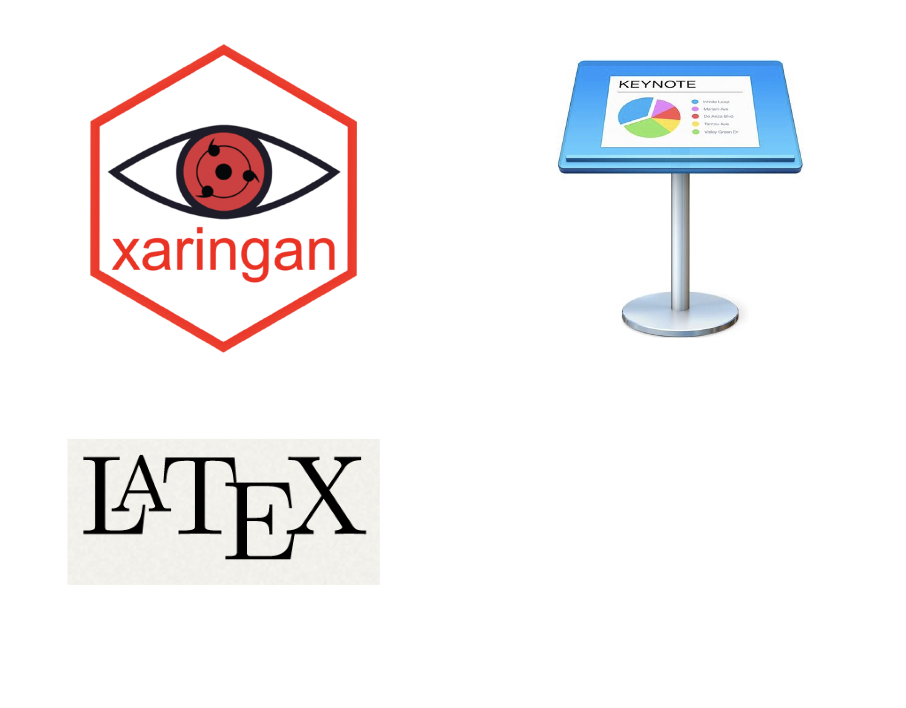
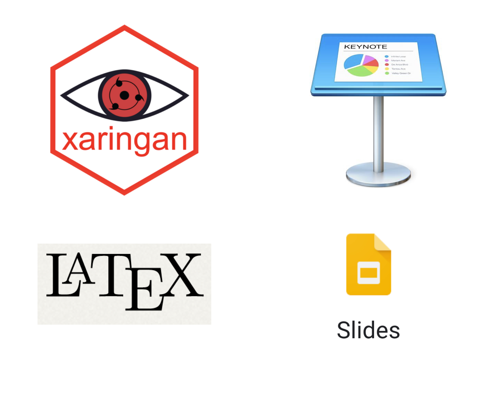

```{r setup, include=FALSE}
knitr::opts_chunk$set(echo = TRUE, 
                      message = FALSE, 
                      warning = FALSE,
                      fig.width = 7,
                      fig.asp = 0.75,
                      fig.retina = 3)
```


name: xaringan-title
class: center, middle
background-image: url(img/jelleke-vanooteghem-gc3sGgo3q1I-unsplash.jpg)
background-size: cover


# .white[Creating Slides with `xaringan`]

# .white[And]

# .white[Developing a Coding Style]

<br>

<br>

### .white[Kelly McConville]

#### .babyblue[Stat 98 | Week 7 | Spring 2022] 

---

name: tools
class: center, middle

# What tools do you currently use to create presentation slides?

---
class: center

## Slide Building Tools


---
class: center

## Slide Building Tools



---
class: center

## Slide Building Tools



---
class: center

## Slide Building Tools



--


**Bottom Line:** Learn multiple tools.


---

## Why Learn `xaringan`?


`xaringan` is good to use if:

--

+ You want HTML slides.


---

## Why Learn `xaringan`?


`xaringan` is good to use if:


+ Have a lot of embedded R work.

```{r, echo= TRUE, warning = FALSE, message=FALSE, fig.height = 2.5, fig.width=5, eval = FALSE}
library(pdxTrees)
library(tidyverse)

# Isabelle's histogram of the inventory date 
count(get_pdxTrees_parks(), Inventory_Date) %>%  
  ggplot(aes(x = Inventory_Date)) +   
  geom_histogram() 
```


```{r, echo= FALSE, warning = FALSE, message=FALSE, fig.height = 2.5, fig.width=5}
library(pdxTrees)
library(tidyverse)

# Isabelle's histogram of the inventory date 
get_pdxTrees_parks() %>%   
  count(Inventory_Date) %>%  
  # setting the aesthetics
  ggplot(aes(x = Inventory_Date)) +   
  # specifying a histogram and picking color! 
  geom_histogram(bins = 50,               
                 fill = "darkgreen", 
                 color = "black") + 
  labs( x = "Inventory Date", 
        y = "Count", 
        title= " When was pdxTrees_parks Inventoried?") + 
  # adding a theme 
  theme_minimal() + 
  theme(plot.title = element_text(hjust = 0.5))
```


---

## Why Learn `xaringan`?


`xaringan` is good to use if:


+ You want to embed an interactive map or application:

```{R leaflet packages, echo = FALSE}
# loading the leaflet packages 
library(leaflet)
library(leaflet.extras)
```

```{r leaflet graph, fig.width= 6, fig.height=4,echo=FALSE}
# making the leaf popup icon 
greenLeaflittle <- makeIcon(
  iconUrl = "https://openclipart.org/download/7973/carlitos-Leaf.svg",
  iconWidth = 10, iconHeight = 20,
  iconAnchorX = 10, iconAnchorY = 10,
 shadowWidth = 10, shadowHeight = 15,
 shadowAnchorX = 5, shadowAnchorY = 5
)
# filtering using dplyr to just Berkeley Park 
berkeley_prk <- get_pdxTrees_parks() %>%
  filter(Park == "Berkeley Park")
# creating the popup label 
labels <- paste("</b>", "Common Name:",
                 berkeley_prk$Common_Name,
                 "</b></br>", "Factoid: ", 
              berkeley_prk$Species_Factoid) 
# creating the map 
leaflet() %>%
  # setting the lng and lat to be in the general area of Berekely Park 
 setView(lng = -122.6239, lat = 45.4726, zoom = 17) %>%  
  # setting the background tiles
  addProviderTiles(providers$Esri.WorldTopoMap) %>%
  # adding the leaf markers with the popup data on top of the circles markers 
  addMarkers( ~Longitude, ~Latitude, 
              data = berkeley_prk,
             icon = greenLeaflittle,
              popup = ~labels) %>%
  # adding the mini map at the bottom right corner 
  addMiniMap()
```


---

## Why Learn `xaringan`?


`xaringan` is good to use if:


+ Want to ensure you are using a reproducible workflow.
    

---

## `xaringan` Demystified

 Slides edited in an R Markdown document. 

--


Knits to HTML.

--

**If you have worked with an R Markdown document before, you can create `xaringan` slides!**

---

## How do I create slides?

.pull-left[

- First slides starts where the YAML (header stuff) ends

- `---` = New Slide


]

.pull-right[

```
---
output: xaringan::moon_reader 
---

# Header on Slide 1

Some stuff

---

# Header for Slide 2 

More stuff

```
]

---

## `xaringan` Demystified


* Let's grab some template slides: 
    + File > New File > R Markdown ... 

```{r, echo = FALSE, out.width = "400px", fig.align='center'}
knitr::include_graphics("img/template.png")
```

---

## `xaringan` Tips!

--
    
* Press ? to see shortcuts.

--

* Use `--` for incremental builds.  (.bright-orange[Warning:] It is fussy!) 


---

## `xaringan` Tips!


.pull-left[


*  To create two columns, use `.pull-left[ ]` and `.pull-right[ ]`


]

.pull-right[

```
---

## `xaringan` Tips!


.pull-left[

Stuff


]

.pull-right[

Other stuff

]
```

]

---

## `xaringan` Tips!

The default resolution for figures is not high enough.

- Chunk option: `fig.retina = 1`


```{r, echo= TRUE, warning = FALSE, message=FALSE, fig.height = 2.5, fig.width=5, eval = TRUE, fig.retina = 1}

# Isabelle's histogram of the inventory date 
count(get_pdxTrees_parks(), Inventory_Date) %>%  
  ggplot(aes(x = Inventory_Date)) +   
  geom_histogram() 
```


---

## `xaringan` Tips!

The default resolution for figures is not high enough.

- Chunk option: `fig.retina = 3`


```{r, echo= TRUE, warning = FALSE, message=FALSE, fig.height = 2.5, fig.width=5, eval = TRUE, fig.retina = 3}

# Isabelle's histogram of the inventory date 
count(get_pdxTrees_parks(), Inventory_Date) %>%  
  ggplot(aes(x = Inventory_Date)) +   
  geom_histogram() 
```

---

## `xaringan` Tips!

You can highlight code with `{{}}`


```{r, echo= TRUE, warning = FALSE, message=FALSE, fig.height = 2.5, fig.width=5, eval = TRUE, fig.retina = 3}

# Isabelle's histogram of the inventory date 
count(get_pdxTrees_parks(), Inventory_Date) %>%  
  ggplot(aes(x = Inventory_Date)) +   
{{  geom_histogram() }}
```


---

## References

* To add in citations:

```{r}
library(RefManageR)
BibOptions(
  check.entries = FALSE, 
  bib.style = "authoryear", 
  cite.style = "authoryear", 
  style = "markdown",
  hyperlink = FALSE, 
  dashed = FALSE)
bibfile <- ReadBib("xaringan.bib")
```

* For inline citations:
  + Using `Citet()`: `r Citet(bibfile, "xie20")`
  + Using `Citep()`: `r Citep(bibfile, "xie20")`
  + Using `NoCite()`: `r NoCite(bibfile, "xie20")`

```{r, include = FALSE}
NoCite(bibfile, "tarr19")
NoCite(bibfile, "r19")
NoCite(bibfile, "hill19")
```


---

## Bibiliography

```{r, echo = TRUE, results = 'asis'}
PrintBibliography(bibfile)
```


---

## General Slide Creation Tips

--

* Creating good slides does take .bright-orange[effort] and should include .bright-orange[revisions].

--

* Use a `r emo::ji("picture")` or `r emo::ji("graph")` over text whenever possible.

--

* Know your audience.

--

.pull-left[

$$
\begin{aligned}
\boldsymbol{\hat{\beta}}_s = & \underset{\boldsymbol{\beta}}{\arg\min}  \left\{ \sum_{i \in s} \frac{(y_i - \boldsymbol{x}_i^T \boldsymbol{\beta})^2}{ \sigma^2_i} \right.\\
& \left. + \lambda \left[ \alpha \sum_{j=1}^p \left|\beta_j\right| + (1-\alpha) \sum_{j=1}^p \beta_j^2\right] \right\}
\end{aligned}
$$


] 


--


.pull-right[


* From Zou, H., & Hastie, T. (2005). Regularization and variable selection via the elastic net.

]

---

## Resources

* I learned `xaringan` (and borrowed heavily for this presentation) from [Alison Hill's online materials](https://alison.rbind.io/) 

--

* [Yihui Xie's (the package developer) introduction](https://slides.yihui.org/xaringan/#1) to `xaringan`


--

* `xaringanthemer`: Great package for easily changing the theme without needing to learn CSS.


---

class: center, middle
background-image: url(img/jelleke-vanooteghem-gc3sGgo3q1I-unsplash.jpg)
background-size: cover


# .white[Questions?]

--

## .white[Shift to Coding Style]

---

## Write Readable Code

* It is important to write readable code.
    + Follow a specific convention.
    + Use spaces liberally.  
    + Avoid . in object names.
    
* Go through the Tidyverse [Style Guide](https://style.tidyverse.org/).

* A similar style guide: [Google's Style Guide](https://google.github.io/styleguide/Rguide.xml).

* As a group, decide on a style convention.  We don't want to see three or four different conventions for a given project.

---


## Write Readable Code

> "Use common sense and BE CONSISTENT.


> If you are editing code, take a few minutes to look at the code around you and determine its style. If others use spaces around their if clauses, you should, too. If their comments have little boxes of stars around them, make your comments have little boxes of stars around them, too.


> The point of having style guidelines is to have a common vocabulary of coding so people can concentrate on what you are saying, rather than on how you are saying it. 


> We present global style rules here so people know the vocabulary. But local style is also important. If code you add to a file looks drastically different from the existing code around it, the discontinuity will throw readers out of their rhythm when they go to read it. Try to avoid this." --Google Style Guide


